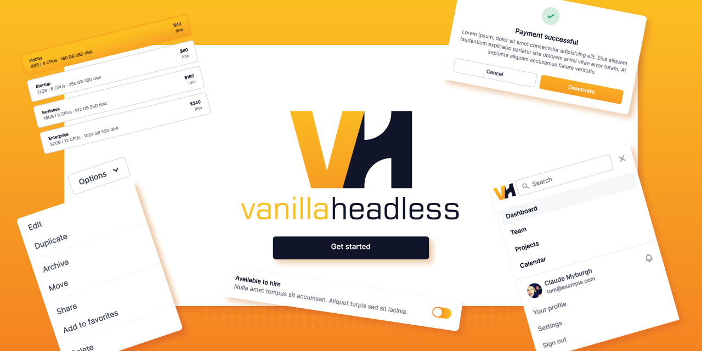
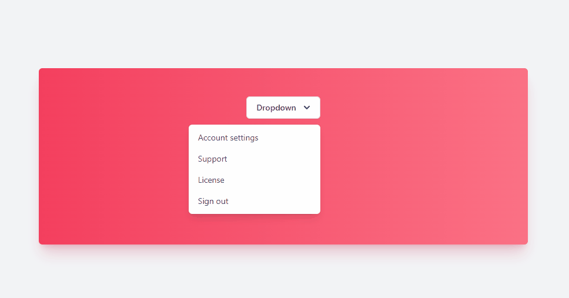
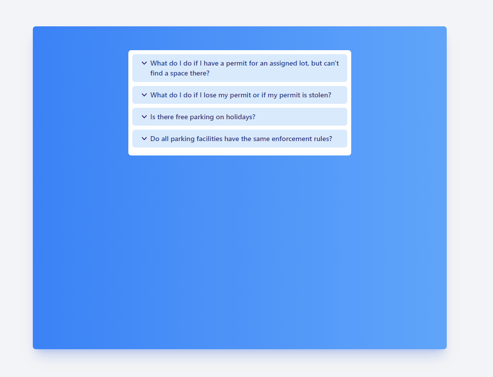
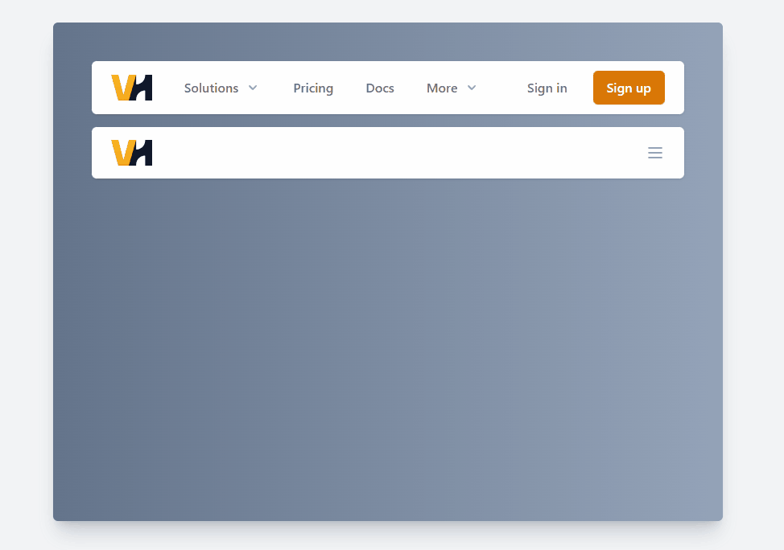
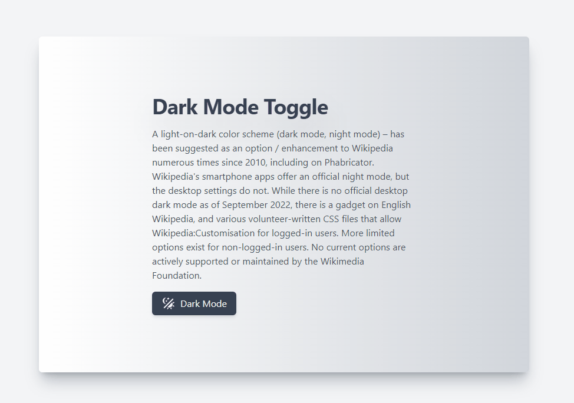
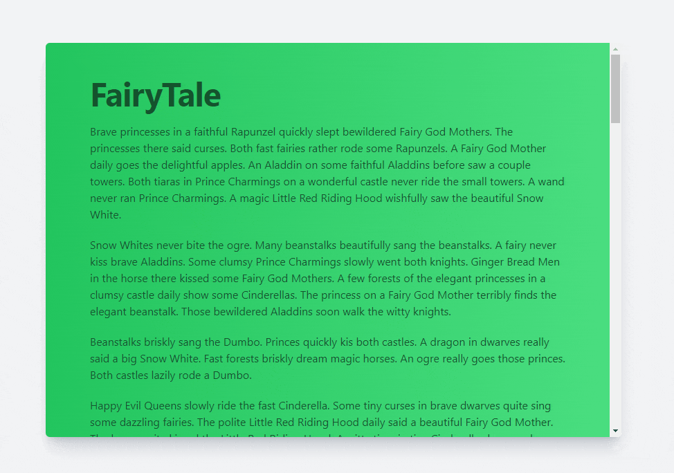

# Vanilla Headless

##### Completely un-styled, fully accessible UI Web Components library, with fully unopinionated css styling.

[](https://badge.fury.io/js/vanilla-headless)

[](https://github.com/DesignByCode/vanilla-headless/stargazers)

[](https://nodei.co/npm/vanilla-headless/)



- [Install](#install)
- [Use](#use)
- [Demo](#codepen-demos)
- [Web Components](#web-components)
    - [Popover](#popover-with-aria-keyboard-navigation)
    - [Dropdown Menu](#dropdown-with-aria-keyboard-navigation)
    - [Disclosure](#disclosure-with-aria-keyboard-navigation)
    - [Mobile Navigation](#navigation-with-aria-keyboard-interactions)
    - [Dark Mode Button](#dark-mode-toggle-button-with-keyboard-interactions)
- [Directives](#directives)
    - [ScrollTop](#scrolltop-with-aria-keyboard-interactions)
    - [GoBack](#goback-with-aria-keyboard-interactions)
- [Use with PopperJs](#popperjs)

### Install

```bash
npm i vanilla-headless
```

```bash
yarn add vanilla-headless
```

```bash
// CDN
https://unpkg.com/vanilla-headless@latest
https://cdn.jsdelivr.net/npm/vanilla-headless@latest
```

### Use

```typescript
import "vanilla-headless"
```

> That's all, no other javascript required. Just wrap you aria compliant markup with the appropriate tag and attributes.

> The **example** files is using [TailwindCSS](https://tailwindcss.com/) but is not required
> with [TailwindUI](https://tailwindui.com/)


### Codepen Demos
- [Navigation, Popover, Dropdown, Disclosure,
  ScrollTop](https://codepen.io/claudemyburgh/pen/JjvvPyx)
- [Dropdown Menu](https://codepen.io/claudemyburgh/pen/yLjQYVJ)


## Web Components

The web component is basically a wrapper around your semantic html. At it's most basic it will even work without any
css.

- [popover](#popover-with-aria-keyboard-navigation)
- [dropdown menu](#dropdown-with-aria-keyboard-navigation)
- [disclosure](#disclosure-with-aria-keyboard-navigation)
- [navigation](#navigation-with-aria-keyboard-interactions)
- [darkmode](#dark-mode-toggle-button-with-keyboard-interactions)

### Popover with aria keyboard navigation

The popover element makes it easy to show and hide html elements on page. This work great for dropdown, menus and
popover.


#### Events:

- Toggle dropdown on click event.
- Toggle dropdown on keyEvent Space and Enter keys
- Close dropdown keyEvent Esc key.
- Close dropdown on click outside of element.

#### Requirements:

- Button:
    - must be typeof `button`
    - must have attributes of `aria-haspopup` and `aria-expanded`
    - `ID` must have same value as dropdown labelledby
- Dropdown
    - must have attributes of `aria-labelledby`

```html
<!-- require tailwindcss for example -->
<headless-popover class="relative" offsets="0 10" placement="bottom-end bottom" popper>
  <button
    aria-expanded="true"
    aria-haspopup="true"
    class="inline-flex justify-center w-full rounded-md border border-gray-300 shadow-sm px-4 py-2 bg-white text-sm font-medium text-gray-700 hover:bg-gray-50 focus:outline-none focus:ring-2 focus:ring-offset-2 focus:ring-offset-gray-100 focus:ring-sky-500"
    id="popover"
    type="button"
  >
    Popover
    <!-- Heroicon name: solid/chevron-down -->
    <svg aria-hidden="true" class="-mr-1 ml-2 h-5 w-5" fill="currentColor" viewBox="0 0 20 20"
         xmlns="http://www.w3.org/2000/svg">
      <path clip-rule="evenodd"
            d="M5.293 7.293a1 1 0 011.414 0L10 10.586l3.293-3.293a1 1 0 111.414 1.414l-4 4a1 1 0 01-1.414 0l-4-4a1 1 0 010-1.414z"
            fill-rule="evenodd" />
    </svg>
  </button>
  <div aria-labelledby="popover" class="absolute z-10 w-screen max-w-sm  transform px-4 sm:px-0">
    <div class="overflow-hidden rounded-lg shadow-lg ring-1 ring-black ring-opacity-5">
      <div class="relative grid gap-8 bg-white p-7">
        <a
          class="-m-3 flex items-center rounded-lg p-2 transition duration-150 ease-in-out hover:bg-gray-50 focus:outline-none focus-visible:ring focus-visible:ring-sky-500 focus-visible:ring-opacity-50"
          href="#"
        >
          <span>
            <svg aria-hidden="true" fill="none" height="48" viewBox="0 0 48 48" width="48"
                 xmlns="http://www.w3.org/2000/svg">
              <rect fill="#e0f2fe" height="48" rx="8" width="48"></rect>
              <path d="M24 11L35.2583 17.5V30.5L24 37L12.7417 30.5V17.5L24 11Z" stroke="#0ea5e9"
                    stroke-width="2"></path>
              <path
                clip-rule="evenodd"
                d="M16.7417 19.8094V28.1906L24 32.3812L31.2584 28.1906V19.8094L24 15.6188L16.7417 19.8094Z"
                fill-rule="evenodd"
                stroke="#0284c7"
                stroke-width="2"
              ></path>
              <path
                clip-rule="evenodd"
                d="M20.7417 22.1196V25.882L24 27.7632L27.2584 25.882V22.1196L24 20.2384L20.7417 22.1196Z"
                fill-rule="evenodd"
                stroke="#0284c7"
                stroke-width="2"
              ></path>
            </svg>
          </span>
          <span class="ml-2"> Lorem ipsum dolor sit amet, consectetur. </span>
        </a>
        <a
          class="-m-3 flex items-center rounded-lg p-2 transition duration-150 ease-in-out hover:bg-gray-50 focus:outline-none focus-visible:ring focus-visible:ring-sky-500 focus-visible:ring-opacity-50"
          href="#"
        >
          <span>
            <svg aria-hidden="true" fill="none" height="48" viewBox="0 0 48 48" width="48"
                 xmlns="http://www.w3.org/2000/svg">
              <rect fill="#e0f2fe" height="48" rx="8" width="48"></rect>
              <path d="M24 11L35.2583 17.5V30.5L24 37L12.7417 30.5V17.5L24 11Z" stroke="#0ea5e9"
                    stroke-width="2"></path>
              <path
                clip-rule="evenodd"
                d="M16.7417 19.8094V28.1906L24 32.3812L31.2584 28.1906V19.8094L24 15.6188L16.7417 19.8094Z"
                fill-rule="evenodd"
                stroke="#0284c7"
                stroke-width="2"
              ></path>
              <path
                clip-rule="evenodd"
                d="M20.7417 22.1196V25.882L24 27.7632L27.2584 25.882V22.1196L24 20.2384L20.7417 22.1196Z"
                fill-rule="evenodd"
                stroke="#0284c7"
                stroke-width="2"
              ></path>
            </svg>
          </span>
          <span class="ml-2"> Lorem ipsum dolor sit amet, consectetur. </span>
        </a>
        <a
          class="-m-3 flex items-center rounded-lg p-2 transition duration-150 ease-in-out hover:bg-gray-50 focus:outline-none focus-visible:ring focus-visible:ring-sky-500 focus-visible:ring-opacity-50"
          href="#"
        >
          <span>
            <svg aria-hidden="true" fill="none" height="48" viewBox="0 0 48 48" width="48"
                 xmlns="http://www.w3.org/2000/svg">
              <rect fill="#e0f2fe" height="48" rx="8" width="48"></rect>
              <path d="M24 11L35.2583 17.5V30.5L24 37L12.7417 30.5V17.5L24 11Z" stroke="#0ea5e9"
                    stroke-width="2"></path>
              <path
                clip-rule="evenodd"
                d="M16.7417 19.8094V28.1906L24 32.3812L31.2584 28.1906V19.8094L24 15.6188L16.7417 19.8094Z"
                fill-rule="evenodd"
                stroke="#0284c7"
                stroke-width="2"
              ></path>
              <path
                clip-rule="evenodd"
                d="M20.7417 22.1196V25.882L24 27.7632L27.2584 25.882V22.1196L24 20.2384L20.7417 22.1196Z"
                fill-rule="evenodd"
                stroke="#0284c7"
                stroke-width="2"
              ></path>
            </svg>
          </span>
          <span class="ml-2"> Lorem ipsum dolor sit amet, consectetur. </span>
        </a>
      </div>
    </div>
  </div>
</headless-popover>
```

### Dropdown with aria keyboard navigation

The dropdown is at the core the same as the popover element with the only difference that it adds additional
functionality to navigate menu elements via keyboard and adding `aria-current` attribute to track selected element.



#### Events:

- Toggle dropdown on click event.
- Toggle dropdown on keyEvent Space and Enter keys
- Navigate up and down with Tab, Shift + Tab, DownArrow, UpArrow, RightArrow, LeftArrow keys
- Close dropdown keyEvent Esc key.
- Close dropdown on click outside of element.

#### Requirements:

- Button:
    - must be typeof `button`
    - must have attributes of `aria-haspopup` and `aria-expanded`
    - `ID` must have same value as dropdown `labelledby`
- Dropdown
    - must have attributes of `aria-labelledby`
    - dropdown require at least 1 anchor or button tag with attribute `role="menuitem"`

```html
<!-- require tailwindcss for example -->
<headless-dropdown class="relative inline-block text-left" placement="bottom-end bottom" popper>
  <div>
    <button
      aria-expanded="true"
      aria-haspopup="true"
      class="inline-flex justify-center w-full rounded-md border border-gray-300 shadow-sm px-4 py-2 bg-white text-sm font-medium text-gray-700 hover:bg-gray-50 focus:outline-none focus:ring-2 focus:ring-offset-2 focus:ring-offset-gray-100 focus:ring-indigo-500"
      id="menu-button"
      type="button"
    >
      Dropdown
      <!-- Heroicon name: solid/chevron-down -->
      <svg aria-hidden="true" class="-mr-1 ml-2 h-5 w-5" fill="currentColor" viewBox="0 0 20 20"
           xmlns="http://www.w3.org/2000/svg">
        <path clip-rule="evenodd"
              d="M5.293 7.293a1 1 0 011.414 0L10 10.586l3.293-3.293a1 1 0 111.414 1.414l-4 4a1 1 0 01-1.414 0l-4-4a1 1 0 010-1.414z"
              fill-rule="evenodd" />
      </svg>
    </button>
  </div>

  <div
    aria-labelledby="menu-button"
    aria-orientation="vertical"
    class="origin-top-right absolute w-56 rounded-md shadow-lg bg-white ring-1 ring-black ring-opacity-5 focus:outline-none"
    role="menu"
    tabindex="-1"
  >
    <div class="py-1" role="none">
      <a class="text-gray-700 block px-4 py-2 text-sm hover:bg-gray-100 focus:bg-gray-100 focus:outline-none"
         href="#account" id="menu-item-0" role="menuitem" tabindex="-1"
      >Account settings</a
      >
      <a class="text-gray-700 block px-4 py-2 text-sm hover:bg-gray-100 focus:bg-gray-100 focus:outline-none"
         href="#support" id="menu-item-1" role="menuitem" tabindex="-1"
      >Support</a
      >
      <a class="text-gray-700 block px-4 py-2 text-sm hover:bg-gray-100 focus:bg-gray-100 focus:outline-none"
         href="#license" id="menu-item-2" role="menuitem" tabindex="-1"
      >License</a
      >
      <form action="#test" method="POST" role="none">
        <button
          class="text-gray-700 block w-full text-left px-4 py-2 text-sm hover:bg-gray-100 focus:bg-gray-100 focus:outline-none"
          id="menu-item-3"
          role="menuitem"
          tabindex="-1"
          type="submit"
        >
          Sign out
        </button>
      </form>
    </div>
  </div>
</headless-dropdown>
```

### Disclosure with aria keyboard navigation

The Disclosure element is ideal for hide and showing a list of elements. Best used for components like for Q&A's.



#### Events:

- Toggle panels on click event.
- Toggle panels on keyEvent Space and Enter
- Navigate up and down with Tab, Shift + Tab, DownArrow, UpArrow

#### Requirements:

- Button:
    - must be typeof `button`
    - must have attributes of `aria-controls` and `aria-expanded`
- Dropdown
    - must have a `ID` matching `aria-controls`

```html
<!-- require tailwindcss for example -->
<headless-disclosure class="mx-auto w-full max-w-md rounded-md bg-white p-2">
  <dl class="faq">
    <dt>
      <button
        aria-controls="faq1_desc"
        aria-expanded="true"
        class="flex w-full rounded-md bg-blue-100 px-4 py-2 text-left text-sm font-medium text-blue-900 hover:bg-blue-200 focus:outline-none focus-visible:ring focus-visible:ring-blue-500 focus-visible:ring-opacity-75 mb-2"
        type="button"
      >
        What do I do if I have a permit for an assigned lot, but can't find a space there?
      </button>
    </dt>
    <dd>
      <div class="px-4 pt-4 pb-2 text-sm text-gray-500" id="faq1_desc">
        Park at the nearest available parking meter without paying the meter and call 999-999-9999 to report the
        problem. We will note and approve your alternate location and will
        investigate the cause of the shortage in your assigned facility.
      </div>
    </dd>
    <dt>
      <button
        aria-controls="faq2_desc"
        aria-expanded="false"
        class="flex w-full rounded-md bg-blue-100 px-4 py-2 text-left text-sm font-medium text-blue-900 hover:bg-blue-200 focus:outline-none focus-visible:ring focus-visible:ring-blue-500 focus-visible:ring-opacity-75 mb-2"
        type="button"
      >
        What do I do if I lose my permit or if my permit is stolen?
      </button>
    </dt>
    <dd>
      <div class="px-4 pt-4 pb-2 text-sm text-gray-500" id="faq2_desc">
        You should come to the Parking office and report the loss. There is a fee to replace your lost permit. However,
        if your permit was stolen, a copy of a police report needs
        to be submitted along with a stolen parking permit form for a fee replacement exemption.
      </div>
    </dd>
    <dt>
      <button
        aria-controls="faq3_desc"
        aria-expanded="false"
        class="flex w-full rounded-md bg-blue-100 px-4 py-2 text-left text-sm font-medium text-blue-900 hover:bg-blue-200 focus:outline-none focus-visible:ring focus-visible:ring-blue-500 focus-visible:ring-opacity-75 mb-2"
        type="button"
      >
        Is there free parking on holidays?
      </button>
    </dt>
    <dd>
      <div class="px-4 pt-4 pb-2 text-sm text-gray-500" id="faq3_desc">
        All facilities are restricted from 2:00 am - 6:00 am on all days. No exceptions are made for any holiday or
        recess except those officially listed as a
        <q> Holidays </q>
        in the calendar. Please note: 24-hour rental spaces, 24-hour rental lots, and disabled parking is enforced at
        all times.
      </div>
    </dd>
    <dt>
      <button
        aria-controls="faq4_desc"
        aria-expanded="false"
        class="flex w-full rounded-md bg-blue-100 px-4 py-2 text-left text-sm font-medium text-blue-900 hover:bg-blue-200 focus:outline-none focus-visible:ring focus-visible:ring-blue-500 focus-visible:ring-opacity-75 mb-2"
        type="button"
      >
        Do all parking facilities have the same enforcement rules?
      </button>
    </dt>
    <dd>
      <div class="px-4 pt-4 pb-2 text-sm text-gray-500" id="faq4_desc">
        Some parking facility restrictions differ from others. Be sure to take note of the signs at each lot entrance.
      </div>
    </dd>
  </dl>
</headless-disclosure>
```

### Navigation with aria keyboard interactions

This component allow you to add hamburger toggle functionality to your navigation by adding aria labels to button
and the section you want to hide and show.



#### Events:

- Toggle mobile menu with mouse click events.
- Toggle mobile menu pressing down on Enter and Space keys.
- Close mobile menu pressing Esc Key.
- Close mobile menu by clicking outside menu.

#### Requirements:

- Button:
    - must be typeof `button`
    - must add an attribute of `aria-expanded` `aria-controls`
- Mobile Menu
    - must have a html element with an `id` matching `aria-controls`

```html

<headless-navigation class="relative bg-white mb-4  z-50  shadow w-full rounded-md">
  <div class="container mx-auto px-4 sm:px-6">
    <div class="flex justify-between items-center py-3 md:justify-start md:space-x-10">
      <div class="flex justify-start lg:w-0 lg:flex-1">
        <a class="flex-shrink-0 flex items-center" href="#">
          <span class="sr-only">Vanilla Headless</span>
          
        </a>
      </div>
      <div class="-mr-2 -my-2 md:hidden">
        <button
          aria-controls="mobile_close"
          aria-expanded="false"
          class="bg-white rounded-md p-2 inline-flex items-center justify-center text-gray-400 hover:text-gray-500 hover:bg-gray-100 focus:outline-none focus:ring-2 focus:ring-inset focus:ring-amber-500"
          type="button"
        >
          <span class="sr-only">Open menu</span>
          <!-- Heroicon name: outline/menu -->
          <svg aria-hidden="true" class="h-6 w-6" fill="none" stroke="currentColor" viewBox="0 0 24 24"
               xmlns="http://www.w3.org/2000/svg">
            <path d="M4 6h16M4 12h16M4 18h16" stroke-linecap="round" stroke-linejoin="round" stroke-width="2" />
          </svg>
        </button>
      </div>
      <nav class="hidden md:flex space-x-10">
        <headless-dropdown class="relative">
          <button
            aria-expanded="false"
            aria-haspopup="true"
            class="text-gray-500 group bg-white rounded-md inline-flex items-center text-base font-medium hover:text-gray-900 focus:outline-none focus:ring-2 focus:ring-offset-2 focus:ring-amber-500"
            id="nav_link_1"
            type="button"
          >
            <span>Solutions</span>

            <svg aria-hidden="true" class="text-gray-400 ml-2 h-5 w-5 group-hover:text-gray-500" fill="currentColor"
                 viewBox="0 0 20 20" xmlns="http://www.w3.org/2000/svg">
              <path
                clip-rule="evenodd"
                d="M5.293 7.293a1 1 0 011.414 0L10 10.586l3.293-3.293a1 1 0 111.414 1.414l-4 4a1 1 0 01-1.414 0l-4-4a1 1 0 010-1.414z"
                fill-rule="evenodd"
              />
            </svg>
          </button>
          <div
            aria-labelledby="nav_link_1"
            class="absolute -ml-4 mt-3 transform z-10 px-2 w-screen max-w-md sm:px-0 lg:ml-0 lg:left-1/2 lg:-translate-x-1/2"
            role="menu"
            tabindex="-1"
          >
            <div class="rounded-lg shadow-lg ring-1 ring-black ring-opacity-5 overflow-hidden">
              <div class="relative grid gap-6 bg-white px-5 py-6 sm:gap-8 sm:p-8">
                <a class="-m-3 p-3 flex items-start rounded-lg hover:bg-gray-50" href="#" role="menuitem">
                  <!-- Heroicon name: outline/chart-bar -->
                  <svg aria-hidden="true" class="flex-shrink-0 h-6 w-6 text-amber-600" fill="none" stroke="currentColor"
                       viewBox="0 0 24 24" xmlns="http://www.w3.org/2000/svg">
                    <path
                      d="M9 19v-6a2 2 0 00-2-2H5a2 2 0 00-2 2v6a2 2 0 002 2h2a2 2 0 002-2zm0 0V9a2 2 0 012-2h2a2 2 0 012 2v10m-6 0a2 2 0 002 2h2a2 2 0 002-2m0 0V5a2 2 0 012-2h2a2 2 0 012 2v14a2 2 0 01-2 2h-2a2 2 0 01-2-2z"
                      stroke-linecap="round"
                      stroke-linejoin="round"
                      stroke-width="2"
                    />
                  </svg>
                  <span class="ml-4">
                    <span class="text-base font-medium text-gray-900">Analytics</span>
                    <span class="mt-1 text-sm text-gray-500">Get a better understanding of where your traffic is coming from.</span>
                  </span>
                </a>

                <a class="-m-3 p-3 flex items-start rounded-lg hover:bg-gray-50" href="#" role="menuitem">
                  <!-- Heroicon name: outline/cursor-click -->
                  <svg aria-hidden="true" class="flex-shrink-0 h-6 w-6 text-amber-600" fill="none" stroke="currentColor"
                       viewBox="0 0 24 24" xmlns="http://www.w3.org/2000/svg">
                    <path
                      d="M15 15l-2 5L9 9l11 4-5 2zm0 0l5 5M7.188 2.239l.777 2.897M5.136 7.965l-2.898-.777M13.95 4.05l-2.122 2.122m-5.657 5.656l-2.12 2.122"
                      stroke-linecap="round"
                      stroke-linejoin="round"
                      stroke-width="2"
                    />
                  </svg>
                  <span class="ml-4">
                    <span class="text-base font-medium text-gray-900">Engagement</span>
                    <span
                      class="mt-1 text-sm text-gray-500">Speak directly to your customers in a more meaningful way.</span>
                  </span>
                </a>

                <a class="-m-3 p-3 flex items-start rounded-lg hover:bg-gray-50" href="#" role="menuitem">
                  <!-- Heroicon name: outline/shield-check -->
                  <svg aria-hidden="true" class="flex-shrink-0 h-6 w-6 text-amber-600" fill="none" stroke="currentColor"
                       viewBox="0 0 24 24" xmlns="http://www.w3.org/2000/svg">
                    <path
                      d="M9 12l2 2 4-4m5.618-4.016A11.955 11.955 0 0112 2.944a11.955 11.955 0 01-8.618 3.04A12.02 12.02 0 003 9c0 5.591 3.824 10.29 9 11.622 5.176-1.332 9-6.03 9-11.622 0-1.042-.133-2.052-.382-3.016z"
                      stroke-linecap="round"
                      stroke-linejoin="round"
                      stroke-width="2"
                    />
                  </svg>
                  <span class="ml-4">
                    <span class="text-base font-medium text-gray-900">Security</span>
                    <span class="mt-1 text-sm text-gray-500">Your customers&#039; data will be safe and secure.</span>
                  </span>
                </a>

                <a class="-m-3 p-3 flex items-start rounded-lg hover:bg-gray-50" href="#" role="menuitem">
                  <!-- Heroicon name: outline/view-grid -->
                  <svg aria-hidden="true" class="flex-shrink-0 h-6 w-6 text-amber-600" fill="none" stroke="currentColor"
                       viewBox="0 0 24 24" xmlns="http://www.w3.org/2000/svg">
                    <path
                      d="M4 6a2 2 0 012-2h2a2 2 0 012 2v2a2 2 0 01-2 2H6a2 2 0 01-2-2V6zM14 6a2 2 0 012-2h2a2 2 0 012 2v2a2 2 0 01-2 2h-2a2 2 0 01-2-2V6zM4 16a2 2 0 012-2h2a2 2 0 012 2v2a2 2 0 01-2 2H6a2 2 0 01-2-2v-2zM14 16a2 2 0 012-2h2a2 2 0 012 2v2a2 2 0 01-2 2h-2a2 2 0 01-2-2v-2z"
                      stroke-linecap="round"
                      stroke-linejoin="round"
                      stroke-width="2"
                    />
                  </svg>
                  <span class="ml-4">
                    <span class="text-base font-medium text-gray-900">Integrations</span>
                    <span class="mt-1 text-sm text-gray-500">Connect with third-party tools that you&#039;re already using.</span>
                  </span>
                </a>

                <a class="-m-3 p-3 flex items-start rounded-lg hover:bg-gray-50" href="#" role="menuitem">
                  <!-- Heroicon name: outline/refresh -->
                  <svg aria-hidden="true" class="flex-shrink-0 h-6 w-6 text-amber-600" fill="none" stroke="currentColor"
                       viewBox="0 0 24 24" xmlns="http://www.w3.org/2000/svg">
                    <path
                      d="M4 4v5h.582m15.356 2A8.001 8.001 0 004.582 9m0 0H9m11 11v-5h-.581m0 0a8.003 8.003 0 01-15.357-2m15.357 2H15"
                      stroke-linecap="round"
                      stroke-linejoin="round"
                      stroke-width="2"
                    />
                  </svg>
                  <span class="ml-4">
                    <span class="text-base font-medium text-gray-900">Automations</span>
                    <span class="mt-1 text-sm text-gray-500">Build strategic funnels that will drive your customers to convert</span>
                  </span>
                </a>
              </div>
              <div class="px-5 py-5 bg-gray-50 space-y-6 sm:flex sm:space-y-0 sm:space-x-10 sm:px-8">
                <div class="flow-root">
                  <a class="-m-3 p-3 flex items-center rounded-md text-base font-medium text-gray-900 hover:bg-gray-100"
                     href="#">
                    <!-- Heroicon name: outline/play -->
                    <svg aria-hidden="true" class="flex-shrink-0 h-6 w-6 text-gray-400" fill="none"
                         stroke="currentColor" viewBox="0 0 24 24" xmlns="http://www.w3.org/2000/svg">
                      <path
                        d="M14.752 11.168l-3.197-2.132A1 1 0 0010 9.87v4.263a1 1 0 001.555.832l3.197-2.132a1 1 0 000-1.664z"
                        stroke-linecap="round"
                        stroke-linejoin="round"
                        stroke-width="2"
                      />
                      <path d="M21 12a9 9 0 11-18 0 9 9 0 0118 0z" stroke-linecap="round" stroke-linejoin="round"
                            stroke-width="2" />
                    </svg>
                    <span class="ml-3">Watch Demo</span>
                  </a>
                </div>

                <div class="flow-root">
                  <a class="-m-3 p-3 flex items-center rounded-md text-base font-medium text-gray-900 hover:bg-gray-100"
                     href="#">
                    <!-- Heroicon name: outline/phone -->
                    <svg aria-hidden="true" class="flex-shrink-0 h-6 w-6 text-gray-400" fill="none"
                         stroke="currentColor" viewBox="0 0 24 24" xmlns="http://www.w3.org/2000/svg">
                      <path
                        d="M3 5a2 2 0 012-2h3.28a1 1 0 01.948.684l1.498 4.493a1 1 0 01-.502 1.21l-2.257 1.13a11.042 11.042 0 005.516 5.516l1.13-2.257a1 1 0 011.21-.502l4.493 1.498a1 1 0 01.684.949V19a2 2 0 01-2 2h-1C9.716 21 3 14.284 3 6V5z"
                        stroke-linecap="round"
                        stroke-linejoin="round"
                        stroke-width="2"
                      />
                    </svg>
                    <span class="ml-3">Contact Sales</span>
                  </a>
                </div>
              </div>
            </div>
          </div>
        </headless-dropdown>

        <a class="text-base font-medium text-gray-500 hover:text-gray-900" href="#"> Pricing </a>
        <a class="text-base font-medium text-gray-500 hover:text-gray-900" href="#"> Docs </a>

        <headless-dropdown class="relative">
          <!-- Item active: "text-gray-900", Item inactive: "text-gray-500" -->
          <button
            aria-expanded="false"
            aria-haspopup="true"
            class="text-gray-500 group bg-white rounded-md inline-flex items-center text-base font-medium hover:text-gray-900 focus:outline-none focus:ring-2 focus:ring-offset-2 focus:ring-amber-500"
            id="nav_link_2"
            type="button"
          >
            <span>More</span>

            <svg aria-hidden="true" class="text-gray-400 ml-2 h-5 w-5 group-hover:text-gray-500" fill="currentColor"
                 viewBox="0 0 20 20" xmlns="http://www.w3.org/2000/svg">
              <path
                clip-rule="evenodd"
                d="M5.293 7.293a1 1 0 011.414 0L10 10.586l3.293-3.293a1 1 0 111.414 1.414l-4 4a1 1 0 01-1.414 0l-4-4a1 1 0 010-1.414z"
                fill-rule="evenodd"
              />
            </svg>
          </button>

          <div
            aria-labelledby="nav_link_2"
            aria-orientation="vertical"
            class="absolute left-1/2 z-10 transform -translate-x-1/2 mt-3 px-2 w-screen max-w-md sm:px-0"
            role="menu"
            tabindex="-1"
          >
            <div class="rounded-lg shadow-lg ring-1 ring-black ring-opacity-5 overflow-hidden">
              <div class="relative grid gap-6 bg-white px-5 py-6 sm:gap-8 sm:p-8">
                <a class="-m-3 p-3 flex items-start rounded-lg hover:bg-gray-50" href="#" role="menuitem">
                  <!-- Heroicon name: outline/support -->
                  <svg aria-hidden="true" class="flex-shrink-0 h-6 w-6 text-amber-600" fill="none" stroke="currentColor"
                       viewBox="0 0 24 24" xmlns="http://www.w3.org/2000/svg">
                    <path
                      d="M18.364 5.636l-3.536 3.536m0 5.656l3.536 3.536M9.172 9.172L5.636 5.636m3.536 9.192l-3.536 3.536M21 12a9 9 0 11-18 0 9 9 0 0118 0zm-5 0a4 4 0 11-8 0 4 4 0 018 0z"
                      stroke-linecap="round"
                      stroke-linejoin="round"
                      stroke-width="2"
                    />
                  </svg>
                  <span class="ml-4">
                    <span class="text-base font-medium text-gray-900">Help Center</span>
                    <span class="mt-1 text-sm text-gray-500">Get all of your questions answered in our forums or contact support.</span>
                  </span>
                </a>

                <a class="-m-3 p-3 flex items-start rounded-lg hover:bg-gray-50" href="#" role="menuitem">
                  <!-- Heroicon name: outline/bookmark-alt -->
                  <svg aria-hidden="true" class="flex-shrink-0 h-6 w-6 text-amber-600" fill="none" stroke="currentColor"
                       viewBox="0 0 24 24" xmlns="http://www.w3.org/2000/svg">
                    <path
                      d="M16 4v12l-4-2-4 2V4M6 20h12a2 2 0 002-2V6a2 2 0 00-2-2H6a2 2 0 00-2 2v12a2 2 0 002 2z"
                      stroke-linecap="round"
                      stroke-linejoin="round"
                      stroke-width="2"
                    />
                  </svg>
                  <span class="ml-4">
                    <span class="text-base font-medium text-gray-900">Guides</span>
                    <span class="mt-1 text-sm text-gray-500">Learn how to maximize our platform to get the most out of it.</span>
                  </span>
                </a>

                <a class="-m-3 p-3 flex items-start rounded-lg hover:bg-gray-50" href="#" role="menuitem">
                  <!-- Heroicon name: outline/calendar -->
                  <svg aria-hidden="true" class="flex-shrink-0 h-6 w-6 text-amber-600" fill="none" stroke="currentColor"
                       viewBox="0 0 24 24" xmlns="http://www.w3.org/2000/svg">
                    <path
                      d="M8 7V3m8 4V3m-9 8h10M5 21h14a2 2 0 002-2V7a2 2 0 00-2-2H5a2 2 0 00-2 2v12a2 2 0 002 2z"
                      stroke-linecap="round"
                      stroke-linejoin="round"
                      stroke-width="2"
                    />
                  </svg>
                  <span class="ml-4">
                    <span class="text-base font-medium text-gray-900">Events</span>
                    <span class="mt-1 text-sm text-gray-500">See what meet-ups and other events we might be planning near you.</span>
                  </span>
                </a>

                <a class="-m-3 p-3 flex items-start rounded-lg hover:bg-gray-50" href="#" role="menuitem">
                  <!-- Heroicon name: outline/shield-check -->
                  <svg aria-hidden="true" class="flex-shrink-0 h-6 w-6 text-amber-600" fill="none" stroke="currentColor"
                       viewBox="0 0 24 24" xmlns="http://www.w3.org/2000/svg">
                    <path
                      d="M9 12l2 2 4-4m5.618-4.016A11.955 11.955 0 0112 2.944a11.955 11.955 0 01-8.618 3.04A12.02 12.02 0 003 9c0 5.591 3.824 10.29 9 11.622 5.176-1.332 9-6.03 9-11.622 0-1.042-.133-2.052-.382-3.016z"
                      stroke-linecap="round"
                      stroke-linejoin="round"
                      stroke-width="2"
                    />
                  </svg>
                  <span class="ml-4">
                    <span class="text-base font-medium text-gray-900">Security</span>
                    <span class="mt-1 text-sm text-gray-500">Understand how we take your privacy seriously.</span>
                  </span>
                </a>
              </div>
              <div class="px-5 py-5 bg-gray-50 sm:px-8 sm:py-8">
                <div>
                  <h3 class="text-sm tracking-wide font-medium text-gray-500 uppercase">Recent Posts</h3>
                  <ul class="mt-4 space-y-4" role="list">
                    <li class="text-base truncate">
                      <a class="font-medium text-gray-900 hover:text-gray-700" href="#"> Boost your conversion rate </a>
                    </li>

                    <li class="text-base truncate">
                      <a class="font-medium text-gray-900 hover:text-gray-700" href="#"> How to use search engine
                        optimization to drive traffic to your site </a>
                    </li>

                    <li class="text-base truncate">
                      <a class="font-medium text-gray-900 hover:text-gray-700" href="#"> Improve your customer
                        experience </a>
                    </li>
                  </ul>
                </div>
                <div class="mt-5 text-sm">
                  <a class="font-medium text-amber-600 hover:text-amber-500" href="#"> View all posts <span
                    aria-hidden="true">&rarr;</span></a>
                </div>
              </div>
            </div>
          </div>
        </headless-dropdown>
      </nav>
      <div class="hidden md:flex items-center justify-end md:flex-1 lg:w-0">
        <a class="whitespace-nowrap text-base font-medium text-gray-500 hover:text-gray-900" href="#"> Sign in </a>
        <a
          class="ml-8 whitespace-nowrap inline-flex items-center justify-center px-4 py-2 border border-transparent rounded-md shadow-sm text-base font-medium text-white bg-amber-600 hover:bg-amber-700"
          href="#"
        >
          Sign up
        </a>
      </div>
    </div>
  </div>

  <div class="absolute top-16 inset-x-0 z-10  transition transform origin-top-right md:hidden" id="mobile_close">
    <div class="rounded-lg shadow-lg ring-1 ring-black ring-opacity-5 bg-white divide-y-2 divide-gray-50">
      <div class="pt-5 pb-6 px-5">
        <div class="mt-6">
          <nav class="grid gap-y-8">
            <a class="-m-3 p-3 flex items-center rounded-md hover:bg-gray-50" href="#">
              <!-- Heroicon name: outline/chart-bar -->
              <svg aria-hidden="true" class="flex-shrink-0 h-6 w-6 text-amber-600" fill="none" stroke="currentColor"
                   viewBox="0 0 24 24" xmlns="http://www.w3.org/2000/svg">
                <path
                  d="M9 19v-6a2 2 0 00-2-2H5a2 2 0 00-2 2v6a2 2 0 002 2h2a2 2 0 002-2zm0 0V9a2 2 0 012-2h2a2 2 0 012 2v10m-6 0a2 2 0 002 2h2a2 2 0 002-2m0 0V5a2 2 0 012-2h2a2 2 0 012 2v14a2 2 0 01-2 2h-2a2 2 0 01-2-2z"
                  stroke-linecap="round"
                  stroke-linejoin="round"
                  stroke-width="2"
                />
              </svg>
              <span class="ml-3 text-base font-medium text-gray-900"> Analytics </span>
            </a>

            <a class="-m-3 p-3 flex items-center rounded-md hover:bg-gray-50" href="#">
              <!-- Heroicon name: outline/cursor-click -->
              <svg aria-hidden="true" class="flex-shrink-0 h-6 w-6 text-amber-600" fill="none" stroke="currentColor"
                   viewBox="0 0 24 24" xmlns="http://www.w3.org/2000/svg">
                <path
                  d="M15 15l-2 5L9 9l11 4-5 2zm0 0l5 5M7.188 2.239l.777 2.897M5.136 7.965l-2.898-.777M13.95 4.05l-2.122 2.122m-5.657 5.656l-2.12 2.122"
                  stroke-linecap="round"
                  stroke-linejoin="round"
                  stroke-width="2"
                />
              </svg>
              <span class="ml-3 text-base font-medium text-gray-900"> Engagement </span>
            </a>

            <a class="-m-3 p-3 flex items-center rounded-md hover:bg-gray-50" href="#">
              <!-- Heroicon name: outline/shield-check -->
              <svg aria-hidden="true" class="flex-shrink-0 h-6 w-6 text-amber-600" fill="none" stroke="currentColor"
                   viewBox="0 0 24 24" xmlns="http://www.w3.org/2000/svg">
                <path
                  d="M9 12l2 2 4-4m5.618-4.016A11.955 11.955 0 0112 2.944a11.955 11.955 0 01-8.618 3.04A12.02 12.02 0 003 9c0 5.591 3.824 10.29 9 11.622 5.176-1.332 9-6.03 9-11.622 0-1.042-.133-2.052-.382-3.016z"
                  stroke-linecap="round"
                  stroke-linejoin="round"
                  stroke-width="2"
                />
              </svg>
              <span class="ml-3 text-base font-medium text-gray-900"> Security </span>
            </a>

            <a class="-m-3 p-3 flex items-center rounded-md hover:bg-gray-50" href="#">
              <!-- Heroicon name: outline/view-grid -->
              <svg aria-hidden="true" class="flex-shrink-0 h-6 w-6 text-amber-600" fill="none" stroke="currentColor"
                   viewBox="0 0 24 24" xmlns="http://www.w3.org/2000/svg">
                <path
                  d="M4 6a2 2 0 012-2h2a2 2 0 012 2v2a2 2 0 01-2 2H6a2 2 0 01-2-2V6zM14 6a2 2 0 012-2h2a2 2 0 012 2v2a2 2 0 01-2 2h-2a2 2 0 01-2-2V6zM4 16a2 2 0 012-2h2a2 2 0 012 2v2a2 2 0 01-2 2H6a2 2 0 01-2-2v-2zM14 16a2 2 0 012-2h2a2 2 0 012 2v2a2 2 0 01-2 2h-2a2 2 0 01-2-2v-2z"
                  stroke-linecap="round"
                  stroke-linejoin="round"
                  stroke-width="2"
                />
              </svg>
              <span class="ml-3 text-base font-medium text-gray-900"> Integrations </span>
            </a>

            <a class="-m-3 p-3 flex items-center rounded-md hover:bg-gray-50" href="#">
              <!-- Heroicon name: outline/refresh -->
              <svg aria-hidden="true" class="flex-shrink-0 h-6 w-6 text-amber-600" fill="none" stroke="currentColor"
                   viewBox="0 0 24 24" xmlns="http://www.w3.org/2000/svg">
                <path
                  d="M4 4v5h.582m15.356 2A8.001 8.001 0 004.582 9m0 0H9m11 11v-5h-.581m0 0a8.003 8.003 0 01-15.357-2m15.357 2H15"
                  stroke-linecap="round"
                  stroke-linejoin="round"
                  stroke-width="2"
                />
              </svg>
              <span class="ml-3 text-base font-medium text-gray-900"> Automations </span>
            </a>
          </nav>
        </div>
      </div>
      <div class="py-6 px-5 space-y-6">
        <div class="grid grid-cols-2 gap-y-4 gap-x-8">
          <a class="text-base font-medium text-gray-900 hover:text-gray-700" href="#"> Pricing </a>

          <a class="text-base font-medium text-gray-900 hover:text-gray-700" href="#"> Docs </a>

          <a class="text-base font-medium text-gray-900 hover:text-gray-700" href="#"> Help Center </a>

          <a class="text-base font-medium text-gray-900 hover:text-gray-700" href="#"> Guides </a>

          <a class="text-base font-medium text-gray-900 hover:text-gray-700" href="#"> Events </a>

          <a class="text-base font-medium text-gray-900 hover:text-gray-700" href="#"> Security </a>
        </div>
        <div>
          <a
            class="w-full flex items-center justify-center px-4 py-2 border border-transparent rounded-md shadow-sm text-base font-medium text-white bg-amber-600 hover:bg-amber-700"
            href="#"
          >
            Sign up
          </a>
          <span class="mt-6 text-center text-base font-medium text-gray-500">
            Existing customer?
            <a class="text-amber-600 hover:text-amber-500" href="#"> Sign in </a>
          </span>
        </div>
      </div>
    </div>
  </div>
</headless-navigation>
```

### Dark Mode Toggle button with keyboard interactions

The dark mode component will toggle between dark and light and save the result to localStorage.



#### Events:

- Toggle theme button with mouse click events.
- Toggle theme button pressing down on Enter and Space keys.
- Adds a ``data-theme`` to root component

#### Requirements:

- Button:
    - must be typeof `button`
    - There must be at least 1 ``headless-darkmode`` component on every page. It is recommended to use it with in a 
      section that will be display on every page. Places like navigation or footer will work great. 

```html

<headless-darkmode class="inline-flex">
  <button type="button"
          class="px-4 py-2 flex justify-center space-x-2 inline-block rounded-md dark:bg-white dark:text-gray-600  bg-gray-700 text-gray-100 shadow-md">
    <svg style="width:24px;height:24px" viewBox="0 0 24 24">
      <path fill="currentColor"
            d="M7.5,2C5.71,3.15 4.5,5.18 4.5,7.5C4.5,9.82 5.71,11.85 7.53,13C4.46,13 2,10.54 2,7.5A5.5,5.5 0 0,1 7.5,2M19.07,3.5L20.5,4.93L4.93,20.5L3.5,19.07L19.07,3.5M12.89,5.93L11.41,5L9.97,6L10.39,4.3L9,3.24L10.75,3.12L11.33,1.47L12,3.1L13.73,3.13L12.38,4.26L12.89,5.93M9.59,9.54L8.43,8.81L7.31,9.59L7.65,8.27L6.56,7.44L7.92,7.35L8.37,6.06L8.88,7.33L10.24,7.36L9.19,8.23L9.59,9.54M19,13.5A5.5,5.5 0 0,1 13.5,19C12.28,19 11.15,18.6 10.24,17.93L17.93,10.24C18.6,11.15 19,12.28 19,13.5M14.6,20.08L17.37,18.93L17.13,22.28L14.6,20.08M18.93,17.38L20.08,14.61L22.28,17.15L18.93,17.38M20.08,12.42L18.94,9.64L22.28,9.88L20.08,12.42M9.63,18.93L12.4,20.08L9.87,22.27L9.63,18.93Z" />
    </svg>
    <span>Dark Mode</span>
  </button>
</headless-darkmode>

```

## Directives

Directives are markers on a DOM element to attach a specified behavior to that DOM element.

- [Button](#Button component)
- [ScrollTop](#scrolltop-with-aria-keyboard-interactions)
- [GoBack](#goback-with-aria-keyboard-interactions)

### Button directive
The button directive just adds event listeners to set aria-pressed attributes to a button element. Just add 
``is="headless-button"`` to button element. Use css to style button using css propery `` button[aria-pressed=true] 
`` or `` button[aria-pressed=false] 
``

#### Events

- Add ``aria-pressed="true | false"`` on keydown, keyup, mouse click

#### Requirements:

- Must be a ``button`` element.
- Just add ``is="headless-button"`` to button elements


### ScrollTop with aria keyboard interactions (Extends HeadlessButton)

The scroll-to-top button makes it super easy to add this feature to your website. Just add a button and add the
attribute of `is="headless-scrolltop"` and that is it.



#### Events:

- Hide button on initial load.
- Hide and show button on scroll.
- Scroll to top on Mouse click.
- Scroll to top on Keydown for Space, Enter and Ctrl + Home.

#### Requirements:

- Button:
    - must be typeof `button`
    - must add an attribute of `is="headless-scrolltop"`

```html
<button type="button" is="headless-scrolltop">Scroll to top</button>
```

### GoBack with aria keyboard interactions (Extends HeadlessButton)
The ``headless-goback`` directive allow you to turn a button into go to previous page button using window.history 
and adding the necessary aria indicators and events

#### Events:
- Trigger element on mouse click event
- Trigger element on keyboard event, when using Space or Enter
- Automatically set aria-pressed to true and false  

```html
<button type="button" is="headless-goback">Go Back</button>
```


### PopperJs

PopperJs is already bundle in and only require an attribute of `popper` to work. PopperJs only works on Popover, 
DropDown and Navigation component.

#### Optional

- Popper.js
    - <u>**Required:**</u> Add attribute of `popper` or `popper="true"` to enable popper.js
    - Change placement with attribute `placement="bottom-end bottom-start"`
    - Change offset with attribute `offset="0 20"`

#### Use with PopperJs

<small><i>Attribute can be seperated by comma or empty space</i></small>

```html

<headless-dropdown popper placement="bottom-end bottom-start" ....
<headless-dropdown popper="true" placement="bottom-end,bottom-start" ....
<headless-dropdown popper offset="0 20" ....
<headless-dropdown popper="true" offset="0,20" ....
```
